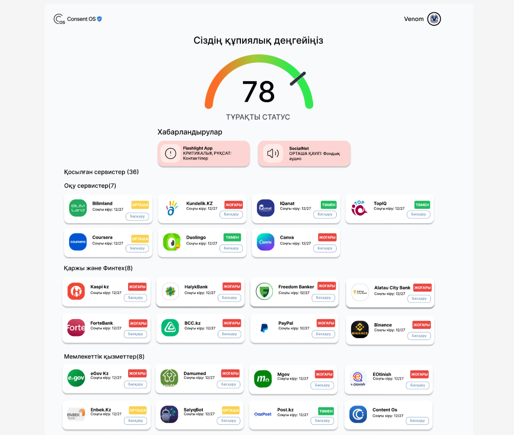
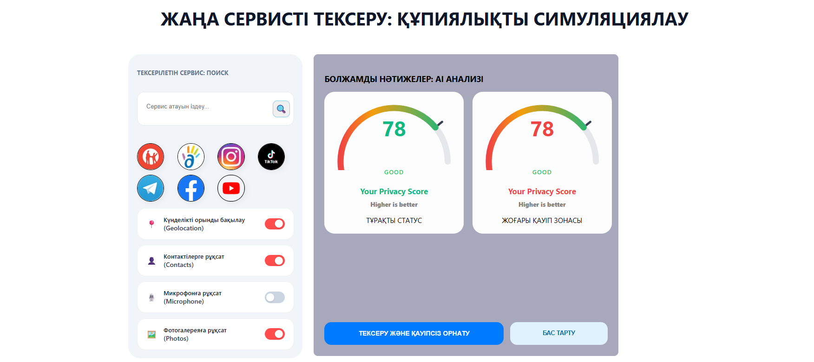

# AI Privacy Auditor — Consent OS

> “Take back control of your digital privacy.”

AI-powered privacy management platform that helps users understand, analyze, and control connected services, permissions, and privacy risks in one dashboard.

---

## 🚀 Overview

**AI Privacy Auditor (Consent OS)** is a fullstack web platform focused on digital privacy and permission management.

The platform allows users to:
- connect services securely
- analyze privacy risks using AI
- monitor connected accounts
- simulate permission impact
- revoke dangerous access instantly

Built during a hackathon and later transformed into a fully working MVP.

---

## ✨ Features

### 🔐 Authentication System
- Email/password authentication
- Google OAuth 2.0 integration
- Secure session handling
- Password hashing with bcrypt

### 📊 Privacy Dashboard
- Connected services overview
- Privacy score system (0–100)
- Risk indicators (LOW / HIGH)
- Real-time permission management

### 🤖 AI Privacy Analysis
- AI-generated explanations of permissions
- Risk analysis for connected services
- Human-readable privacy insights
- Smart recommendations

### ⚡ Simulation Engine
Simulate application installation before connecting it:
- analyze permissions
- estimate privacy impact
- preview security risks
- AI-powered scoring

### 🚫 Revoke Access
One-click revoke system:
- remove connected services
- update dashboard instantly
- sync with backend database

---

## 🛠️ Tech Stack

### Frontend
- React
- React Router
- JavaScript
- CSS

### Backend
- FastAPI
- Python
- REST API

### Database
- SQLite

### Authentication
- Google OAuth 2.0
- bcrypt

### AI Integration
- OpenAI API
- Groq API

### Deployment
- Vercel

---

## 🧠 Architecture

```text
Frontend (React)
       ↓
REST API (FastAPI)
       ↓
Database (SQLite)
       ↓
AI Analysis Layer
```

The application follows a SPA (Single Page Application) architecture using React Router for seamless navigation.

---

## 📂 Core Functionalities

| Feature | Description |
|---|---|
| Dashboard | Monitor connected services |
| AI Explain | Explain permissions in simple language |
| Privacy Score | Evaluate privacy protection level |
| Simulation | Predict app privacy impact |
| Revoke | Instantly remove permissions |

---

## 🔥 Challenges Faced

This project involved solving real-world engineering problems:

- OAuth callback routing
- Frontend/backend deployment issues
- CORS configuration
- Environment variable security
- API integration
- Database synchronization
- GitHub secret scanning protection

---

## 📸 Screenshots

_Add screenshots here_

```md
<p align="center">
  
</p>
<p align="center">
  
</p>
```

---

## ⚙️ Installation

### Clone repository

```bash
git clone https://github.com/AldyShap/ai-privacy-auditor.git
```

---

### Backend setup

```bash
cd Backend
pip install -r requirements.txt
```

Create `.env`

```env
GOOGLE_CLIENT_ID=your_client_id
GOOGLE_CLIENT_SECRET=your_secret
OPENAI_API_KEY=your_key
GROQ_API_KEY=your_key
```

Run backend:

```bash
uvicorn app.main:app --reload
```

---

### Frontend setup

```bash
cd Frontend/ConsentOS
npm install
npm run dev
```

---

## 🌍 Vision

Consent OS aims to become a centralized privacy management ecosystem where users can fully understand and control how their personal data is used online.

The long-term vision includes:
- enterprise integrations
- e-government privacy tools
- advanced AI monitoring
- PostgreSQL migration
- 2FA support
- real revoke token management

---

## 👨‍💻 Team Venom

Built with passion during Hackathon 2026.

---

## 📌 Project Status

✅ MVP Completed  
✅ OAuth Working  
✅ Dashboard Working  
✅ AI Simulation Implemented  
✅ Service Revoke System Working

---

## 📜 License

MIT License

---

## ⭐ Support

If you like the project, consider giving it a star on GitHub ⭐
